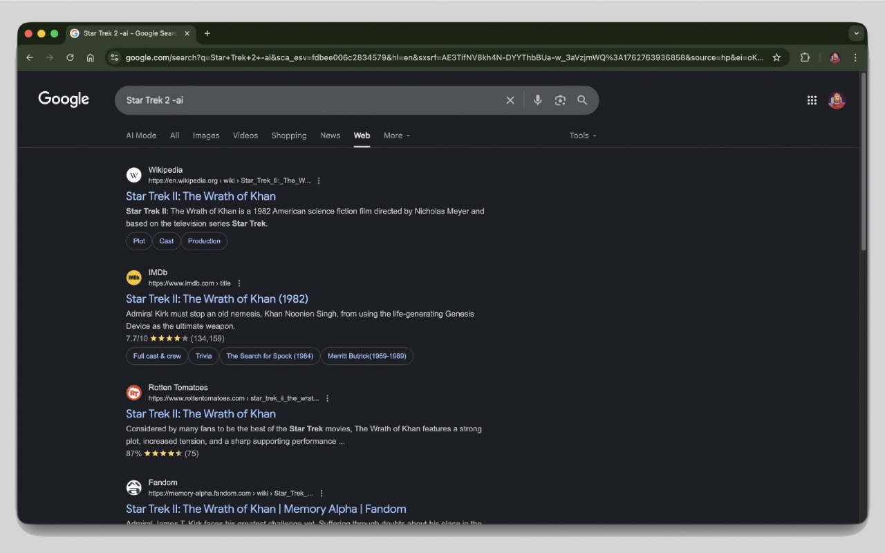

# De-AI Google Browser Extension

The Google AI Overview of search results is often quite bad, so this extension automatically modifies Google search queries to exclude AI-generated results by appending "-ai" to your searches. Available for both Chrome and Safari.

## Features

- **Automatic AI Exclusion**: Appends `-ai` to all Google search queries to filter out AI-generated content
- **Smart Query Processing**: Prevents duplicate `-ai` additions and normalizes queries
- **Form Interception**: Handles both direct URL navigation and form submissions
- **Dynamic Updates**: Works with single-page application navigation and history changes

## How It Works

The extension uses content scripts to ensure consistent behavior:

1. **Content Script**: Modifies search queries in real-time and handles form submissions
2. **URL Rewriting**: Processes both direct navigation and dynamic page changes

## Technical Details

### Query Modification Logic

1. **Normalization**: Removes existing `-ai` terms to prevent duplication
2. **Addition**: Appends ` -ai` to the cleaned query
3. **Deduplication**: Tracks last applied URL to prevent infinite redirects

### Browser Compatibility

- **Chrome**: ✅ Fully supported (Manifest V3)
- **Edge**: ✅ Fully supported (Chromium-based, uses Chrome files)
- **Safari**: ⚠️ Presently in development
- **Firefox**: ❌ Not compatible (uses Chrome-specific APIs)

## Configuration

The extension works out of the box with no configuration required. Supports major Google search domains:

- `google.com`
- `google.co.uk`, `google.ca`, `google.de`
- `google.fr`, `google.it`, `google.es`
- `google.com.au`, `google.co.jp`
- And other Google country domains

## Privacy

This extension:

- ✅ Does NOT collect any personal data
- ✅ Does NOT send data to external servers
- ✅ Only modifies Google search URLs locally
- ✅ Works entirely within your browser

## Version History

### 1.0.0

- Available for Chrome

## License

This project is licensed under the MIT License - see the [LICENSE](LICENSE) file for details.

MIT License allows you to freely use, modify, and distribute this software.

---

**Note**: This extension modifies Google search behavior. Google may update their search parameters or detection methods, which could affect functionality.
